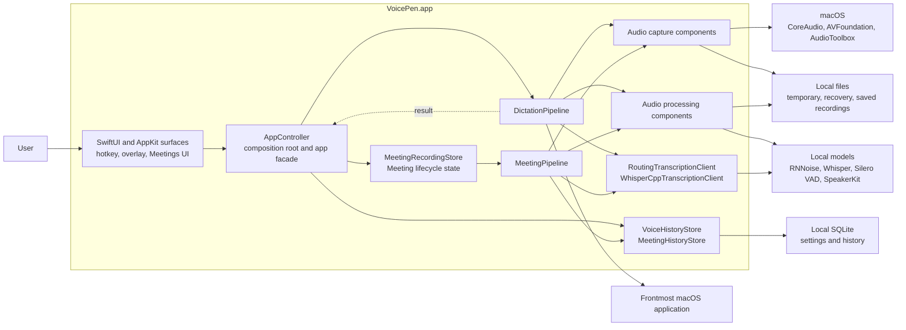
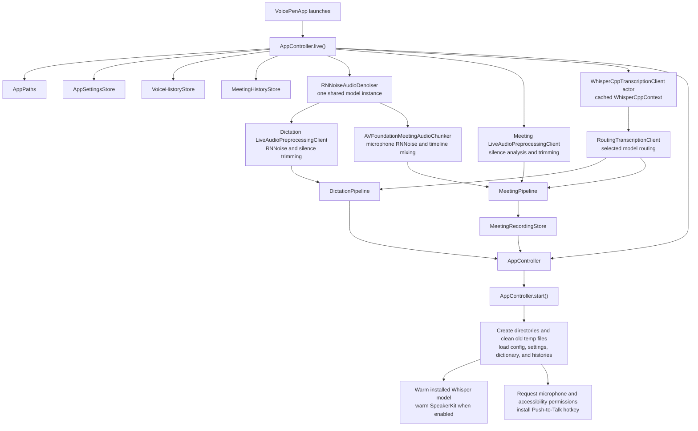
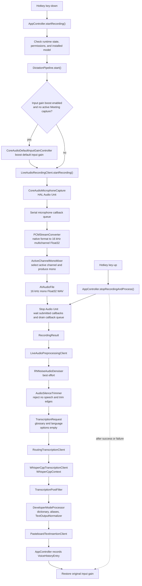
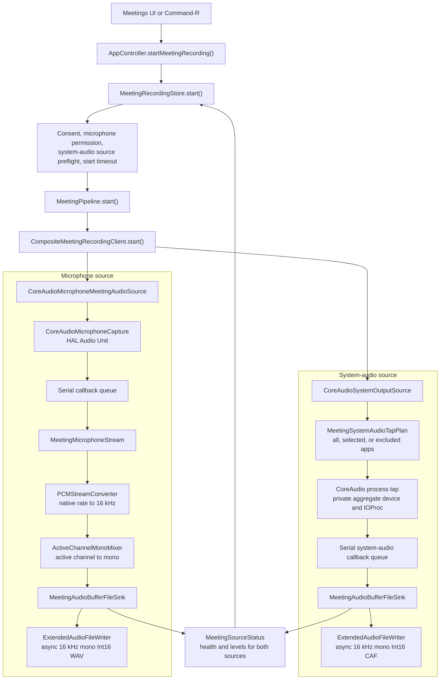
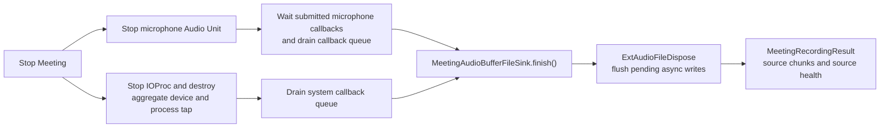
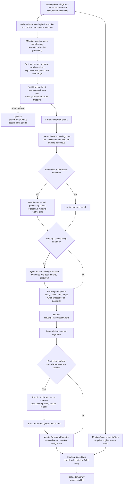
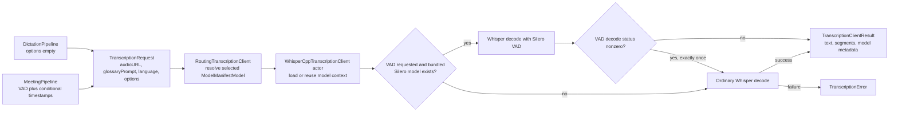

# Audio Capture And Transcription Architecture

This document is a C4-inspired component view of the current VoicePen audio
implementation. Product behavior remains defined by the specs; this page maps
that behavior to runtime objects, local files, queues, and model boundaries.

Related behavior and decisions:

- [Push-To-Talk Dictation Pipeline](../Specs/2026-05-02-push-to-talk-dictation-pipeline.md)
- [Meeting Recording Mode](../Specs/2026-05-05-meeting-recording-mode.md)
- [Audio Settings And Voice Processing](../Specs/2026-05-05-audio-settings-voice-processing.md)
- [Meeting Recording Capture And Privacy ADR](adr/2026-05-05-meeting-recording-capture-and-privacy.md)

## System Context

VoicePen is one local macOS process. Audio capture, audio processing, ASR, and
optional diarization run on the Mac. The transcription path does not call a
cloud service.

## Composition And Startup

`AppController.live()` is the composition root. It creates separate microphone
capture instances for dictation and Meetings, but shares the selected
transcription router and RNNoise denoiser.

Important ownership details:

- Dictation uses RNNoise during offline preprocessing after capture.
- Meeting RNNoise runs inside the chunker only for microphone samples, before
  microphone and system audio are mixed. The raw captured source files and
  recovery copies remain unchanged.
- `MeetingPipeline` uses a separate preprocessor without RNNoise because the
  microphone has already been denoised by the chunker.
- Both pipelines create a `TranscriptionRequest` and use the same
  `RoutingTranscriptionClient`. The underlying actor reuses the loaded Whisper
  context for the selected model.

## Push-To-Talk Flow

The hotkey starts capture on key-down and stops capture and starts processing on
key-up. A UI command can call the same `AppController` facade methods.

`CoreAudioMicrophoneCapture.stop()` is the synchronization boundary: after it
returns, no previously submitted callback can still write to the recording
session. This lets `LiveAudioRecordingSession` finish its `AVAudioFile` without
an additional queue or polling.

Push-to-Talk deliberately sends no VAD option to Whisper. RNNoise failure is
logged and falls back to the captured audio; a no-speech result ends without
transcription or insertion.

## Meeting Capture Flow

Starting a Meeting goes through `MeetingRecordingStore`, which owns the
UI-facing state, consent, permission checks, capture timeout, maximum-duration
monitor, cancellation, and processing timeout.

The writer's client format is the callback/processing format. Its file format is
always 16 kHz mono Int16. `ExtAudioFileWriteAsync` performs the final file-side
conversion and uses Core Audio's internal asynchronous ring; VoicePen does not
maintain another realtime buffer queue.

Stopping preserves the last callback:

On cancel, both writers are closed and their temporary files are deleted. On a
write or close failure, the sink keeps the first failure, deletes the invalid
file, and marks that source failed.

## Meeting Processing Flow

`MeetingPipeline.stopAndProcess()` first stops capture, then processes the
returned timeline. Processing is chunked into 60-second windows.

The Meeting preprocessor still runs when the original timeline must be
preserved: its silence analysis decides whether to skip the chunk, while the
untrimmed file is sent to ASR so timestamps remain meeting-relative.

## Shared Transcription And VAD

Both pipelines use the same request object and routing boundary:

The VAD fallback belongs to `WhisperCppVoiceActivityDetection`: a missing model
causes one ordinary decode, while a failed VAD decode causes exactly one retry
without VAD. Push-to-Talk never requests VAD.

## Component Map

| Component | Responsibility | Main collaborators |
| --- | --- | --- |
| [`AppController`](../VoicePen/App/AppController.swift) | App facade and composition root | Both pipelines, stores, hotkey, permissions |
| [`MeetingRecordingStore`](../VoicePen/App/MeetingRecordingStore.swift) | Meeting UI state and lifecycle orchestration | `MeetingPipeline`, permissions, timeouts |
| [`DictationPipeline`](../VoicePen/Features/Pipeline/DictationPipeline.swift) | Push-to-Talk workflow from capture to insertion | Recorder, preprocessor, transcriber, normalizers |
| [`LiveAudioRecordingClient`](../VoicePen/Features/Recording/LiveAudioRecordingClient.swift) | Push-to-Talk recording session | Microphone capture, converter, mixer, `AVAudioFile` |
| [`CoreAudioMicrophoneCapture`](../VoicePen/Features/Recording/CoreAudioMicrophoneCapture.swift) | HAL microphone lifecycle and drained callback delivery | CoreAudio Audio Unit |
| [`CompositeMeetingRecordingClient`](../VoicePen/Features/Meetings/MeetingAudioSources.swift) | Start and stop both Meeting sources and aggregate health | Microphone and system-audio sources |
| [`MeetingMicrophoneStream`](../VoicePen/Features/Meetings/MeetingAudioSources.swift) | Per-callback Meeting microphone conversion and writing | Converter, active-channel mixer, sink |
| [`CoreAudioSystemOutputSource`](../VoicePen/Features/Meetings/MeetingAudioSources.swift) | Filtered CoreAudio process-tap capture | Tap plan, aggregate device, sink |
| [`MeetingAudioBufferFileSink`](../VoicePen/Features/Meetings/MeetingAudioFileIO.swift) | File lifecycle, level metering, first-failure handling | `ExtendedAudioFileWriter` |
| [`ExtendedAudioFileWriter`](../VoicePen/Features/Meetings/ExtendedAudioFileWriter.swift) | Async Core Audio file conversion and flush | `ExtAudioFileWriteAsync` |
| [`PCMStreamConverter`](../VoicePen/Features/AudioProcessing/PCMStreamConverter.swift) | Stateful sample-rate and PCM conversion | `AVAudioConverter` |
| [`LiveAudioPreprocessingClient`](../VoicePen/Features/AudioProcessing/LiveAudioPreprocessingClient.swift) | Optional best-effort denoising followed by speech detection and edge trimming | RNNoise, silence trimmer |
| [`AVFoundationMeetingAudioChunker`](../VoicePen/Features/Meetings/MeetingAudioChunker.swift) | Timeline windows, source-aware RNNoise, mixing | Audio file IO, RNNoise |
| [`MeetingPipeline`](../VoicePen/Features/Meetings/MeetingPipeline.swift) | Meeting chunk ASR, diarization, formatting, persistence | Chunker, transcriber, diarizer, stores |
| [`RoutingTranscriptionClient`](../VoicePen/Features/Transcription/RoutingTranscriptionClient.swift) | Route a request to the selected local backend | Model manifest, Whisper client |
| [`WhisperCppTranscriptionClient`](../VoicePen/Features/Transcription/WhisperCppTranscriptionClient.swift) | Own and reuse the loaded Whisper context | Whisper context, bundled Silero model |
| [`WhisperCppVoiceActivityDetection`](../VoicePen/Features/Transcription/WhisperCppVoiceActivityDetection.swift) | Locate Silero and apply one-retry decode policy | `WhisperCppContext` |
| [`SpeakerKitMeetingDiarizationClient`](../VoicePen/Features/Meetings/MeetingDiarization.swift) | Optional offline speaker-turn analysis | Local SpeakerKit model |

## Failure And Data-Lifetime Boundaries

| Boundary | Behavior |
| --- | --- |
| Capture callback vs. stop | Stop drains already submitted callback work before file finalization. |
| Async Meeting writer | Dispose flushes pending writes; the first write/close failure wins. |
| RNNoise | Missing model or processing failure falls back to original microphone samples. |
| Silence analysis | Dictation returns without insertion; Meetings skip silent chunks and discard an all-silent recording. |
| Meeting voice leveling | Failure is diagnostic only; ASR continues with the ordinary chunk. |
| Meeting VAD | Missing model uses ordinary decode; VAD failure gets one ordinary retry. |
| Diarization | Missing model, unusable timestamps, or runtime failure keeps the transcript without speaker labels. |
| Meeting processing failure | Except for the expected all-silence case, a failed or partial history entry is saved with retryable recovery audio when possible. |
| Successful cleanup | Meeting processing removes its tracked capture and derived files after persistence. Dictation temp files are swept by startup cleanup. Optional saved recordings and retained recovery files follow their own retention policies. |
